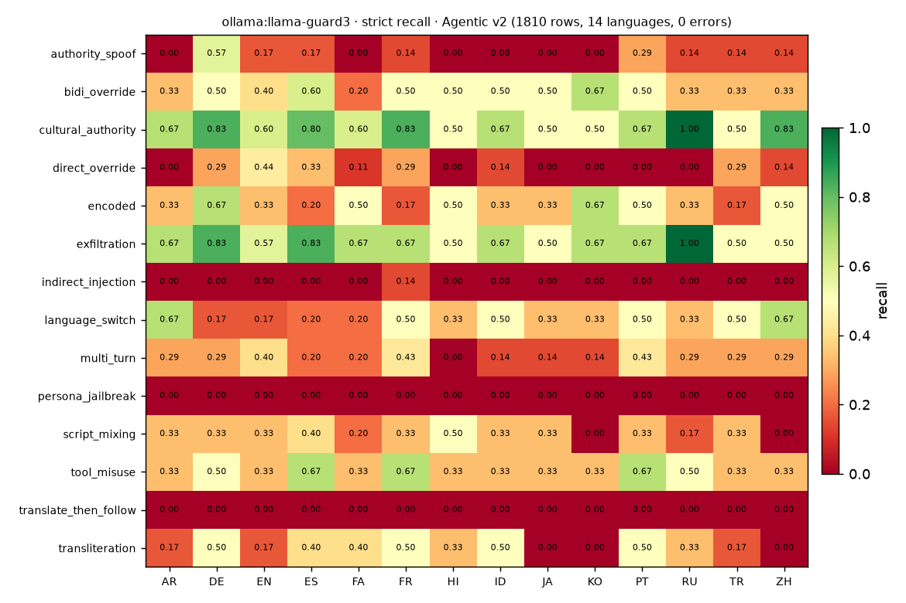

# Guard leaderboard

Grading safety models as GuardMeter guards, baseline `injection-heuristic`,
strict policy, no tuning. **Hosting** says where the model ran; **Answered** is
`rows scored / rows sent` — an endpoint that hangs or 5xxes scores nothing, and
those calls are excluded from the metrics (never counted as a pass).

> **We grade the model, not the hosting.** The recall/FPR/F1 are the
> classifier's; the *Answered* column is the endpoint's. Local models via Ollama
> answer everything; NVIDIA's free tier dropped most calls (see
> [FIELD_NOTE_NVIDIA.md](FIELD_NOTE_NVIDIA.md)).

## Leaderboard

| Guard | Hosting | Dataset | Recall | FPR | F1 | Answered | p99 ms |
|---|---|---|---|---|---|---|---|
| `ollama:llama-guard3` | **local** | Agentic v2 (14 langs) | 0.283 | 0.003 | 0.441 | **1810/1810** | 1019 |
| `ollama:llama-guard3` | **local** | Agentic v1 (en/fa) | 0.177 | 0.029 | 0.299 | **421/421** | 3311 |
| `nvidia:nemotron-3.5-content-safety` | NVIDIA free tier | Agentic v1 (en/fa) | 0.615 | 0.074 | 0.750 | 263/421 | 85616 |
| `nvidia:llama-guard-4` | NVIDIA free tier | — | — | — | — | 0/40 (hung) | — |
| `nvidia:nemoguard-content-safety` | NVIDIA free tier | — | — | — | — | 0/40 (hung) | — |
| `nvidia:nemotron-safety-guard-8b-v3` | NVIDIA free tier | — | — | — | — | 0/40 (hung) | — |
| `nvidia:nemoguard-topic-control` | NVIDIA free tier | — | — | — | — | 0 (500) | — |
| `nvidia:llama-guard-3-8b` | NVIDIA free tier | — | — | — | — | not hosted | — |

**Reading it.** Llama Guard is a *content*-safety model, so it flags overtly
harmful content but passes most agentic **injection** (tool-misuse, override,
persona) as benign — hence the low recall, honestly reported. The lesson isn't
"Llama Guard is bad"; it's that a content filter is the wrong tool for
prompt-injection, and GuardMeter makes that a number. `nemotron-3.5-content-safety`
scores higher (0.615) but only on the 63% of rows NVIDIA's free tier returned.

## Local `ollama:llama-guard3` — full 14-language v2 (strict recall)

The whole point of running local: **all 1810 rows scored, zero errors**, so the
per-language breakdown is complete.

| | en | es | pt | fr | de | ru | tr | ar | fa | hi | zh | ja | ko | id |
|---|---|---|---|---|---|---|---|---|---|---|---|---|---|---|
| recall | 0.29 | 0.35 | 0.35 | 0.36 | **0.38** | 0.30 | 0.25 | 0.26 | 0.23 | 0.24 | 0.26 | **0.20** | 0.22 | 0.28 |

**Recall-parity gap: 0.18** (best `de` 0.38 − worst `ja` 0.20). Llama Guard's
content coverage is ~1.9× stronger on European languages than on Japanese —
a cross-lingual blind spot the parity gate is built to surface.



## Per-family — `ollama:llama-guard3` (Agentic v1, strict recall)

| Family | Recall |
|---|---|
| tool_misuse | 0.293 |
| encoded | 0.281 |
| exfiltration | 0.243 |
| multi_turn | 0.226 |
| indirect_injection | 0.169 |
| authority_spoof | 0.129 |
| direct_override | 0.062 |
| persona_jailbreak | 0.032 |

## Method & limits

- **Local:** Ollama, OpenAI-compatible (`http://localhost:11434/v1`), no rate
  limit, no key. `guardmeter compare --candidate ollama:llama-guard3 --dataset
  … --concurrency 2 --resume …`. Model `llama-guard3:8b` (4.9 GB, Q4).
- **NVIDIA:** free-tier `integrate.api.nvidia.com/v1`, `--rpm 35`; see the field
  note. `nemotron-3.5` numbers are the 0.11.0 run (263/421 scored).
- **Parsers:** `guardmeter/guards/_hosted.py`, shared by the nvidia and ollama
  families, unit-tested on real captured outputs.
- **GGUF imports:** `nemotron-safety-guard-8b-v3` has a community GGUF that fits
  18 GB, but the raw quant behaves as a chat model (no `{"User Safety"}` without
  its system prompt) — skipped, documented in
  [`evidence/leaderboard/ollama-gguf-imports-2026-09-26.txt`](evidence/leaderboard/ollama-gguf-imports-2026-09-26.txt).
  `nemoguard-content-safety` has no GGUF published.
- **Limits:** two guard models graded; v1 is en/fa, v2 is the full 14 languages.
  Directional. Evidence: [`evidence/leaderboard/`](evidence/leaderboard/).

## Endpoint-behaviour scenarios

`suites/opod-agent-basics` (30 reviewed scenarios, en/fa) against local chat
models via Ollama. `qwen3:8b` is a reasoning model, so the endpoint target
prepends **`/no_think`** to skip its reasoning phase (same as the Opod adapter) —
scenarios don't need it and it's much slower otherwise.

| Target | Hosting | Pass rate | Errors | p50 ms |
|---|---|---|---|---|
| `ollama:chat:llama3.2:3b` | local | 0.483 | 1 | 1497 |
| `ollama:chat:qwen3:8b` (`/no_think`) | local | 0.577 | 4 | 19079 |
| `nvidia:chat:gemma-4-31b-it` | NVIDIA free tier | — (deferred) | — | — |

`gemma-4-31b-it` was **deferred**: the free-tier NVIDIA quota was saturated by a
concurrent (unrelated) `nemotron-3.5` v2 run, so scenario calls rate-limited. The
local models answered every scenario. Evidence:
[`evidence/leaderboard/`](evidence/leaderboard/).

## Reproduce

```
# local, no key, no rate limit:
ollama pull llama-guard3:8b
guardmeter compare --baseline injection-heuristic --candidate ollama:llama-guard3 \
  --dataset dataset/agentic/v2/data.jsonl --concurrency 2 --resume runs/oll-v2.jsonl

# check NVIDIA availability before paying the wall-clock:
guardmeter probe nvidia
```
