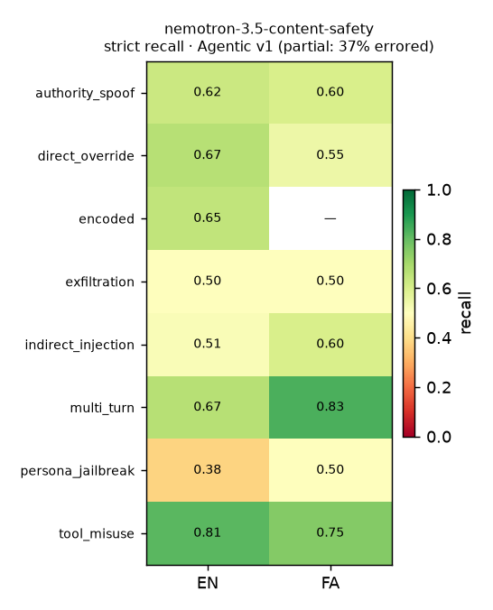

# NVIDIA-hosted guard leaderboard

Grading **NVIDIA-hosted safety models** as GuardMeter guards, over the
OpenAI-compatible endpoint `https://integrate.api.nvidia.com/v1`
(**free tier**), on **2026-09-26**. Baseline for every run is the local
`injection-heuristic` guard; the candidate is the NVIDIA guard being graded.
No thresholds were tuned.

> **We grade the model, not NVIDIA's hosting.** The scores below are the
> classifier's, but the run itself was shaped by hosting: on the free tier, five
> of the six named safety endpoints were **not reliably runnable** at run time
> (cold-start timeouts or 5xx), and even the one that ran errored on ~37% of
> calls. That is a note on the free-tier serving, not on the models' quality.

## Leaderboard — Agentic Attack Dataset v1 (English + Farsi, strict policy)

| Guard | Model id | Status | Recall | FPR | F1 | Error rate | p50 / p99 ms |
|---|---|---|---|---|---|---|---|
| `nvidia:nemotron-3.5-content-safety` | `nvidia/nemotron-3.5-content-safety` | ran (263/421 scored) | **0.615** | 0.074 | 0.750 | 0.375 | 6263 / 85616 |
| `nvidia:llama-guard-4` | `meta/llama-guard-4-12b` | resolved · timeout | — | — | — | — | — |
| `nvidia:nemoguard-content-safety` | `nvidia/llama-3.1-nemoguard-8b-content-safety` | resolved · timeout | — | — | — | — | — |
| `nvidia:nemotron-safety-guard-8b-v3` | `nvidia/llama-3.1-nemotron-safety-guard-8b-v3` | resolved · timeout (intermittent) | — | — | — | — | — |
| `nvidia:nemoguard-topic-control` | `nvidia/llama-3.1-nemoguard-8b-topic-control` | resolved · 500 (TensorRT-LLM) | — | — | — | — | — |
| `nvidia:llama-guard-3-8b` | `meta/llama-guard-3-8b` | **not hosted** (absent from `/v1/models`) | — | — | — | — | — |

`recall`/`FPR`/`F1` are over the rows that returned a verdict; **error rate** is
the fraction of calls that never returned one (excluded from the metrics, never
counted as a pass). Availability evidence:
[`evidence/nvidia/availability-probe-2026-09-26.txt`](evidence/nvidia/availability-probe-2026-09-26.txt).

## Language parity — `nemotron-3.5-content-safety`

| Language | Scored | Strict recall |
|---|---|---|
| en (English) | 189 | 0.612 |
| fa (Persian) | 74 | 0.625 |

**Recall-parity gap (en vs fa): 0.013.** v1 covers only English and Farsi; the
14-language v2 parity heatmap lands in **0.11.1** once the detached v2 run
completes (see below).

## Per-family breakdown — `nemotron-3.5-content-safety` (strict recall)

| Family | Recall | Scored |
|---|---|---|
| tool_misuse | 0.792 | 32 |
| multi_turn | 0.708 | 32 |
| encoded | 0.647 | 23 |
| direct_override | 0.636 | 59 |
| authority_spoof | 0.615 | 17 |
| indirect_injection | 0.533 | 61 |
| exfiltration | 0.500 | 25 |
| persona_jailbreak | 0.400 | 14 |



The model is strongest on overt tool-misuse and multi-turn build-ups, weakest on
persona-jailbreak and exfiltration — but each cell rests on a partial sample
(37% of calls errored), so read directionally, not as a rate.

## Endpoint-behaviour scenarios — deferred to 0.11.1

The plan also runs `suites/opod-agent-basics` against three NVIDIA-hosted chat
models. At run time all three were unavailable on the free tier —
`nvidia/llama-3.1-nemotron-70b-instruct` and `mistralai/mistral-large-2-instruct`
returned **404** for chat completions (listed in `/v1/models` but not invocable
on this account), and `google/gemma-4-31b-it` **timed out**
([`evidence/nvidia/chat-probe-2026-09-26.txt`](evidence/nvidia/chat-probe-2026-09-26.txt)).
The scenario leaderboard is deferred to **0.11.1** with the detached v2 run.

## Method & limits

- **Endpoint:** NVIDIA `integrate.api.nvidia.com/v1` (OpenAI-compatible), **free
  tier**, `NVIDIA_API_KEY`. Model ids resolved from `GET /v1/models` at runtime.
- **Runner:** `guardmeter compare --candidate nvidia:<preset> --dataset
  dataset/agentic/v1/data.jsonl --rpm 35 --concurrency 4 --resume <ckpt>`.
  Client-side 35 rpm cap; 429/`Retry-After` + jittered backoff; API failures
  after retries → excluded `error` results. `--resume` retries only errored
  rows, which is how the completed fraction rose across passes (187 → 222 → 263).
- **Dataset:** Agentic v1, 421 rows, record-SHA `5c6902dcc0bb…`.
- **Parsers:** each safety model's prompt/parse lives in `guardmeter/guards/nvidia.py`,
  unit-tested on real captured outputs (`tests/guardmeter/test_nvidia_guard.py`).
- **Limits:** partial coverage (nemotron-3.5 scored 263/421); one model only;
  English+Farsi (v1); a single free-tier account on one day. Directional. The
  full 14-language v2 leaderboard is deferred to **0.11.1** (detached run).

## Reproduce

```
export NVIDIA_API_KEY=...   # NVIDIA_BASE_URL optional; defaults to integrate.api.nvidia.com/v1
guardmeter compare --baseline injection-heuristic \
  --candidate nvidia:nemotron-3.5-content-safety \
  --dataset dataset/agentic/v1/data.jsonl --rpm 35 --concurrency 4 \
  --resume runs/nv1-nemotron35.jsonl --json
```
